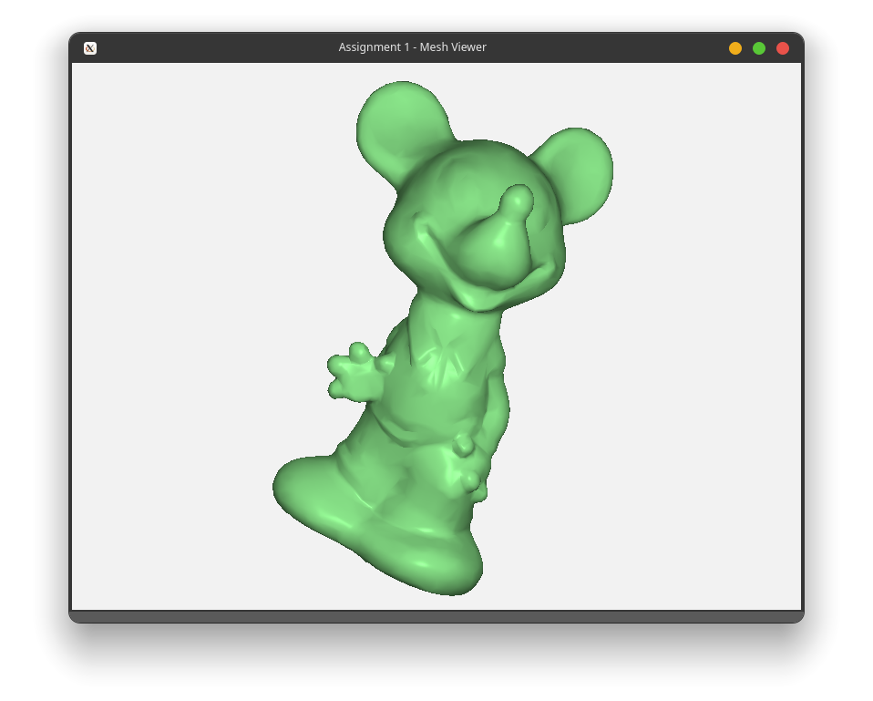
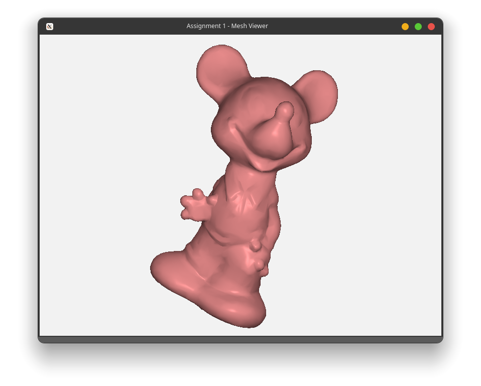
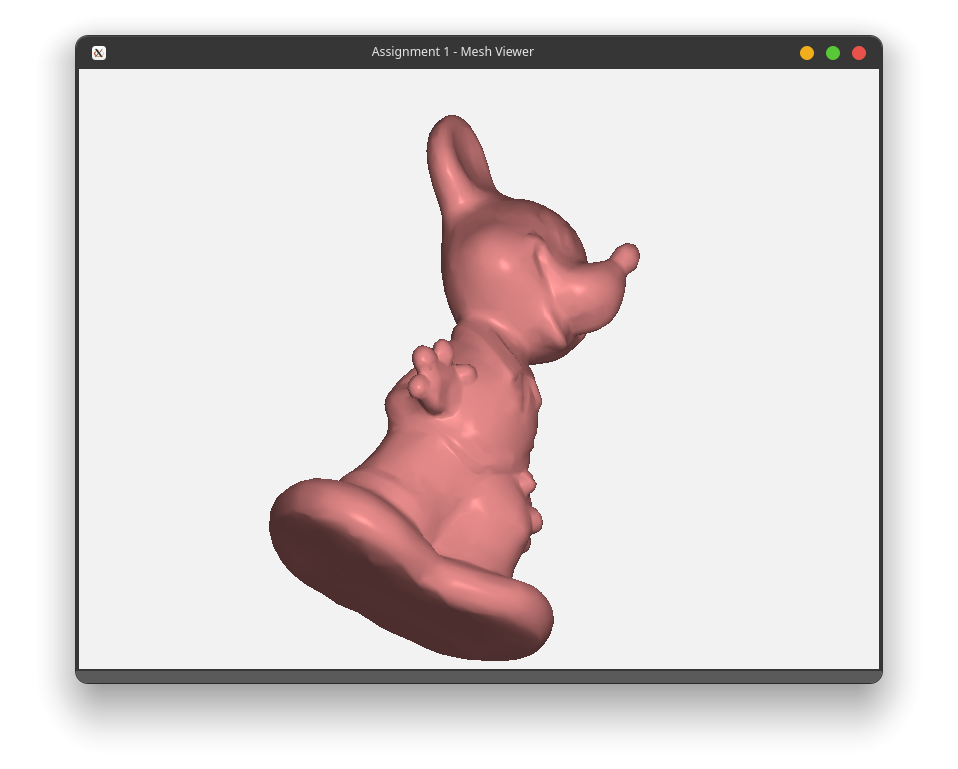
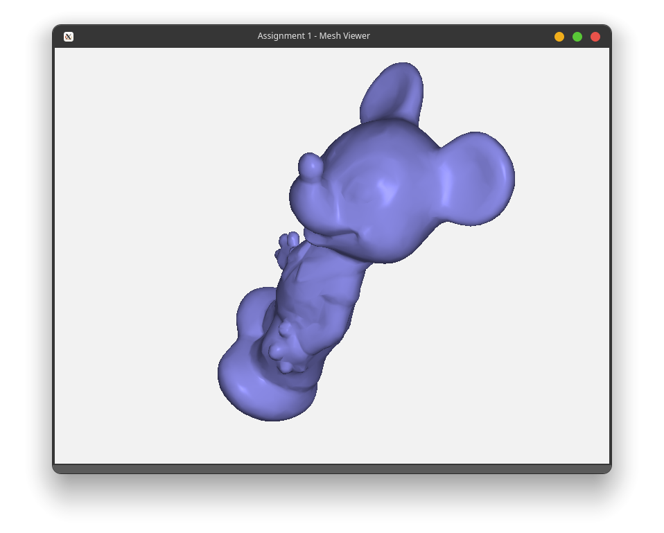
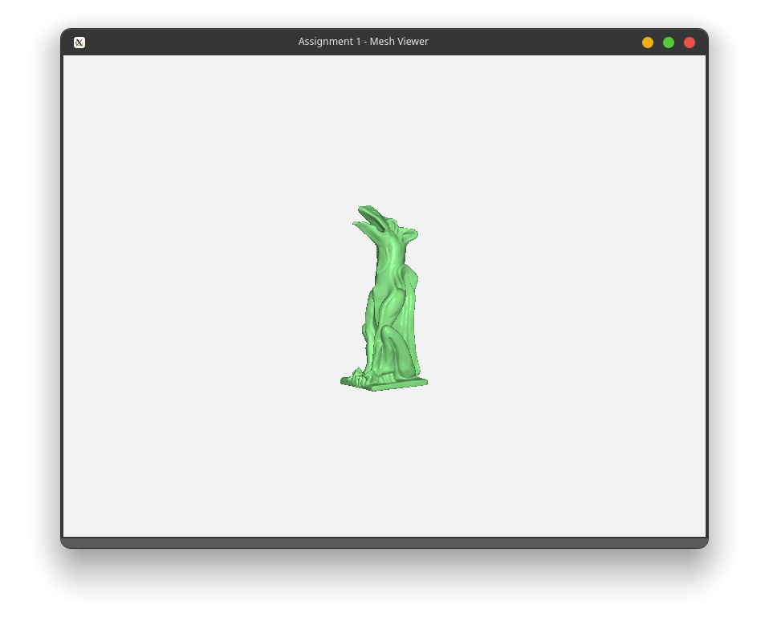
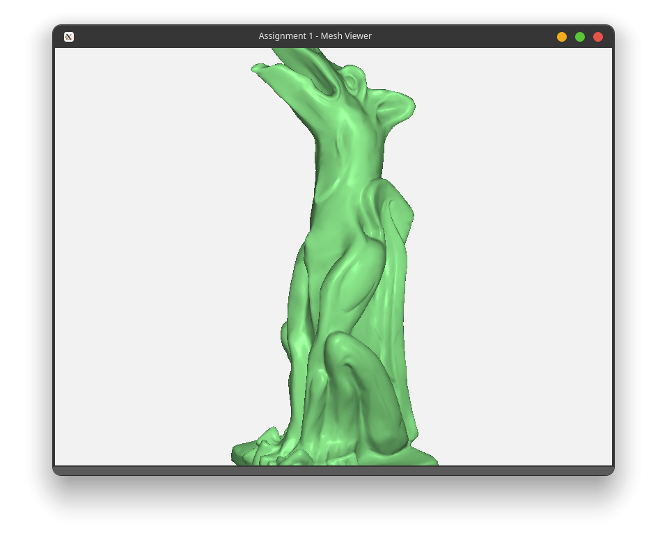
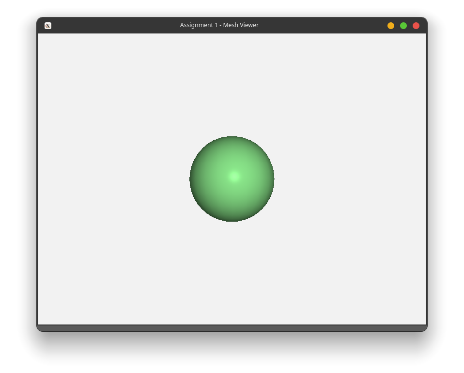

# Assignment 1

## How to run

```bash
# tested on Linux
cmake .
make
./Assignment_1
```

Change the target object in line 105 in `main.cpp` to render a different object.

## Screenshots

_mickey.obj_



_mickey.obj with different colour_



_mickey.obj rotated_


_mickey.obj rotated_


_garg.obj zoomed out_


_garg.obj zoomed in_


_sphere.obj_


## Explanations

### LoadInput

Using the specified file path, we parse the file line by line. In each line, we read the line contents, and depending on the identifier, we parse the contents in a different way.

- If `v` or `vn`: add it to the list of vectors or normals
- If `f`: add each vertex of the face to `triList`, and map the vertex to its normal
- Otherwise, line is ignored

We then iterate through the vertices, and fetch the corresponding normal from the map, and push them to `verList`.

### SetMeshColor

Since there are four predetermined colours, we can cycle through them using `colorID = (colorID + 1) % 4;`.

### RotateModel

I used `glm`'s `rotate` function, which performs the calculations based on the angle and axis and updates the `modelMatrix` accordingly.

### TranslateModel

In order to translate the model, we simply add the vector to the camera's current position.

### Scaling

I used `glm`'s `scale` function, which performs the calculations based on the angle and axis and updates the `modelMatrix` accordingly.
