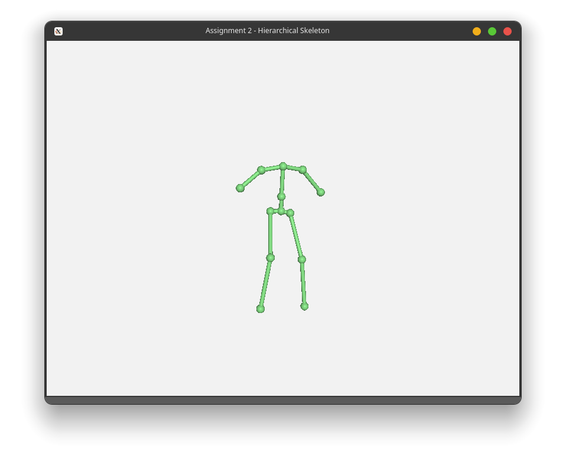
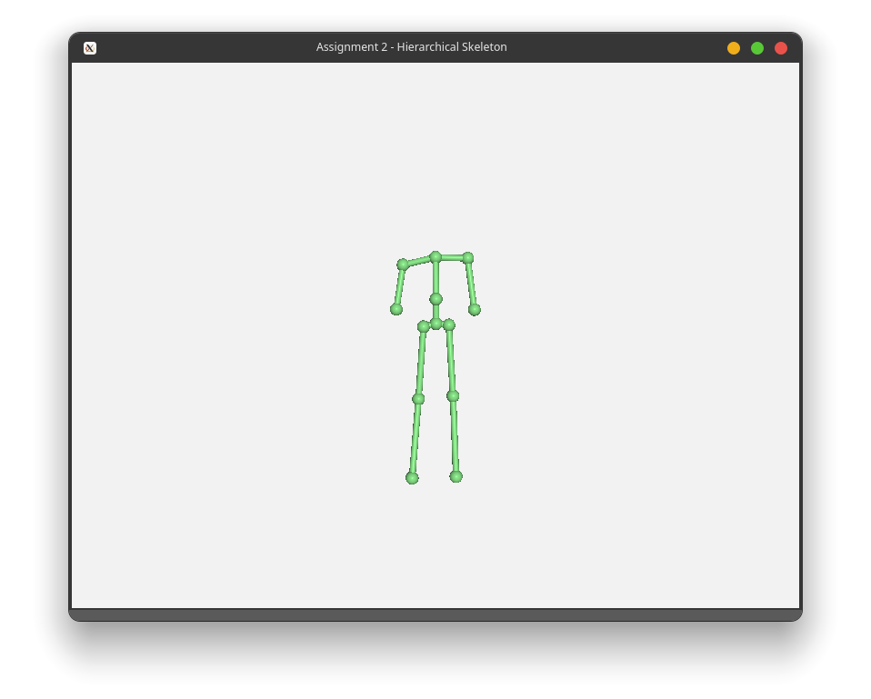
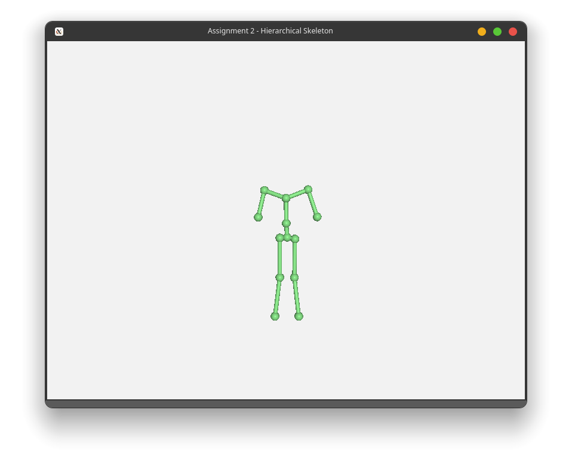
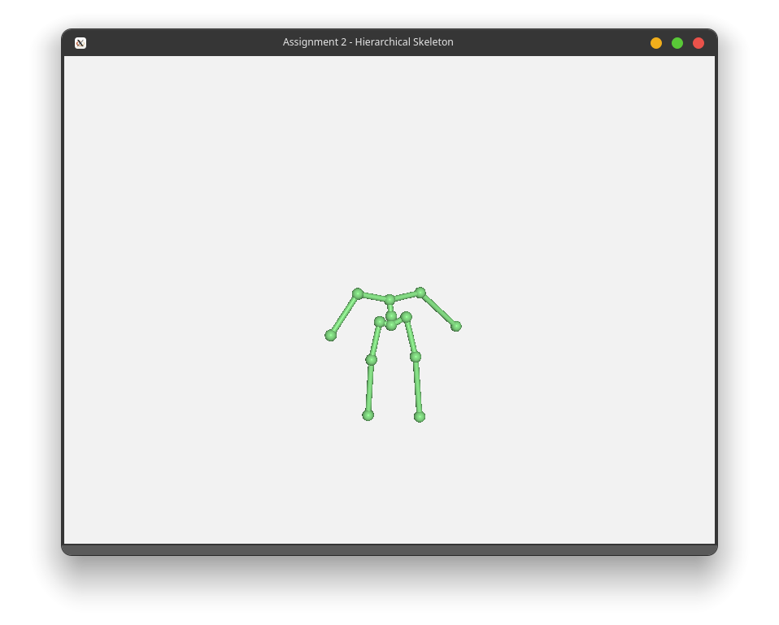
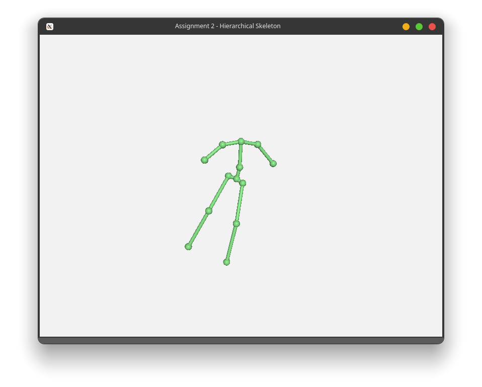
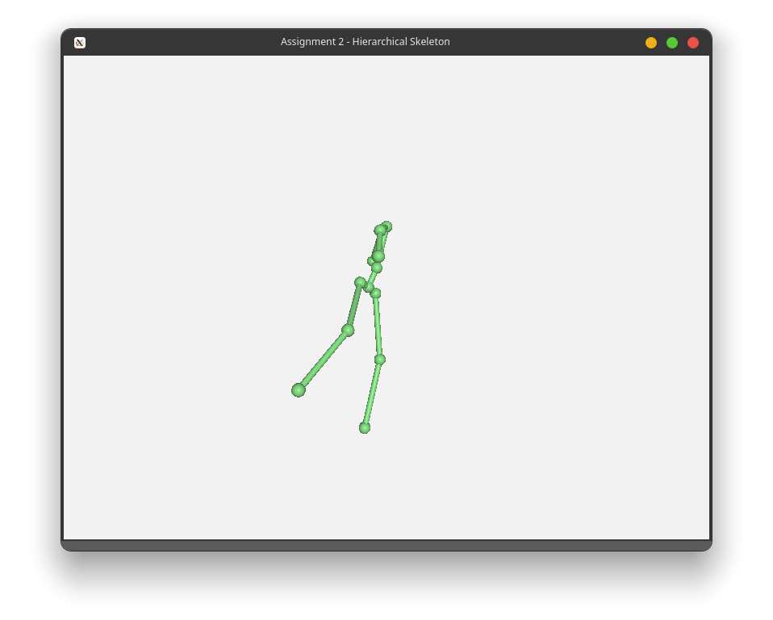
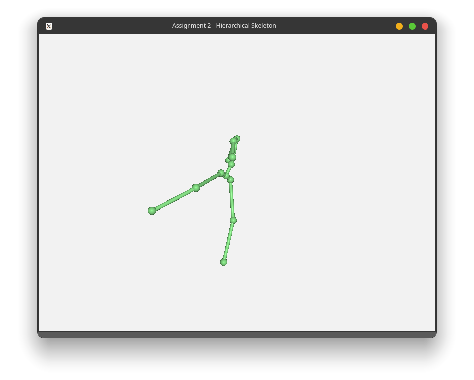

# Assignment 2

## How to run

```bash
# tested on Linux
cmake .
make
./Assignment_2
```

Enter the path of the `.skel` file relative to binary executable to view skeleton.

## Screenshots

_Model1.skel_



_Model2.skel_



_Model3.skel_



_Model4.skel_



_Transforming Joint 1's x axis in Model1.skel_



_Transforming Joint 3's x axis in Model1.skel (before)_



_Transforming Joint 3's x axis in Model1.skel (after)_



## Explanations

Major problem encountered: loading transforms into the matrix stack required the matrix to be transposed first due to the matrix multiplication calculation. This was hard to find and took time to debug.

### loadSkeleton

We read the x, y, and z axis transforms and construct a 4x4 transpose matrix with the following scheme

```
+---------------+
| 1 | 0 | 0 | x |
| 0 | 1 | 0 | y |
| 0 | 0 | 1 | z |
| 0 | 0 | 0 | 1 |
+---------------+
```

and push it to the `m_joints` vector. When the index of the line is -1, we set that joint as the root joint, otherwise, we add the current joint to the children vector of the parent joint by looking up the vector index.

### computeJointTransforms

We set up a function where the current transform is added to the matrix stack (which does the multiplication for us), and then recursively calls the function for all children. Once we have reached the maximum recursion depth (i.e. reached a joint with no more children), we push the current matrix stack to `jointMatList` and pop the matrix stack. We go back through the recursion stack, progressively popping the matrix stack until the root joint.

### computeBoneTransforms

Similar to joint transforms, we have a recursive function based on pushing and popping the matrix stack. However, we require some processing as we need to find the axes and length of the cylinder.

To find the axes, we find the 4th column of the transform matrix as that gives us the direction to the next joint. The z axis is simply the normalized direction. To find the y axis, we find the cross product of the z axis and the base z axis (`(0, 0, 1)` vector). To find the x axis, we find the cross product of the computed y and z axes. We then transform z and scale y as per the handout definition and multiply these with the matrix stack to construct the cylinder. We then recursively call this function for all children.

### setJointTransform

We utilise glm's rotate function to construct the rotation matrix for each axis, and then multiply the joint's tranform matrix with the three rotation matrices to get the new transform matrix for the joint.
