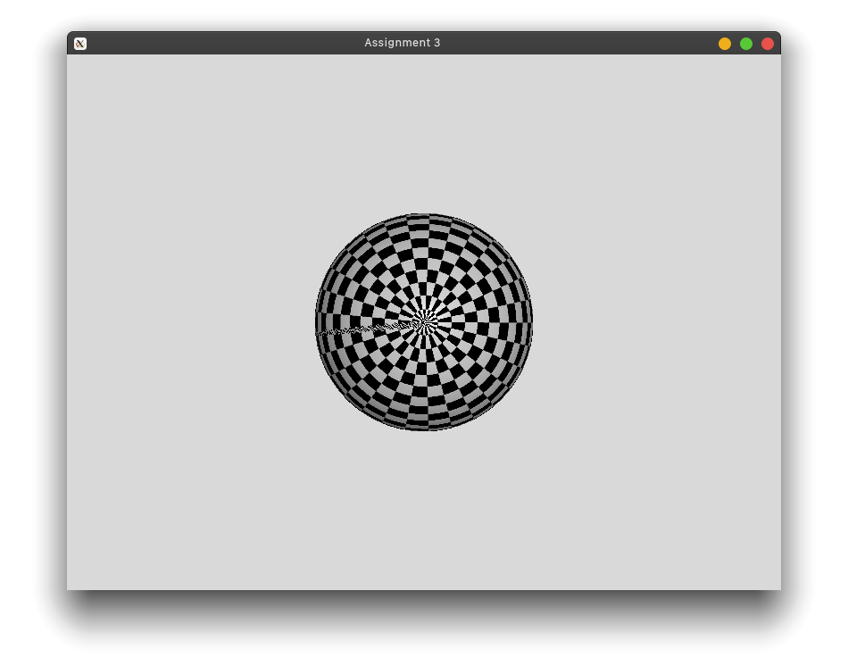
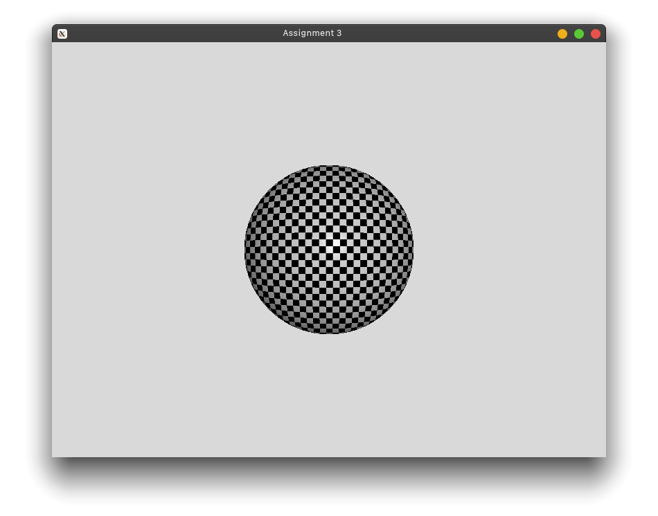

# Assignment 3

## How to run

```bash
# tested on Linux
cmake .
make
./Assignment_3
```

Enter the path of the `.obj` and `.png` file relative to binary executable to view object.

Change texture path at `main.cpp` L694, path relative to binary executable.

## Screenshots

_Sphere with cylindrical mapping (side view)_


_Sphere with cylindrical mapping (bottom view)_


_Sphere with spherical mapping (side view)_


_Sphere with spherical mapping (bottom view)_



_Sphere with planar mapping (side view)_



_Sphere with planar mapping (bottom view)_


## Explanations

### calcPlaneMapping

- Map the x & y coordinates in the model to the u and v coordinates in the texture image respectively
- The model(origin at its center with height of 1) coordinates is ranged from -0.5 to 0.5 but the texture map is ranged from 0 to 1, thus, we need to offset the x & y coordinate by 0.5 during the texture mapping

### calcCylindricalMapping

- Compute the angle theta which lies on the XZ-plane using $arctan(z/x)$ since $z = rsin(\theta)$ and $x = rcos(\theta)$
- The angle $\theta$ is range between $-\pi <= 0 <= \pi$ and it needs to map to the texture map u axis which range from 0 to 1. The conversion can be done using $(angle + \pi) / (2 * \pi)$
- The y coordinates can be mapped to the height of the cylindrical which is the texture map v axis which range from 0 to 1. However, the model origin is at its center with height of 1, we need to offset the y coordinates by 0.5 during the texture mapping

### calcSphereMapping

- Calculate radius of circle using $p = sqrt(x^2 + y^2 + z^2)$
- Calculate theta (XZ plane) using $arctan(z/x)$, $\theta \in [-\pi, \pi]$
- Calculate $\phi(Y-axis)$ using $arccos(y/p)$, $\phi \in [0, \pi]$
- Map the $\theta$ to the u axis of texture map which ranges from 0 to 1 using $(\theta + \pi) / (2 * \pi)$
- Map the $\phi$ to the v axis of the texture map which ranges from 0 to 1 using $\phi / \pi$
