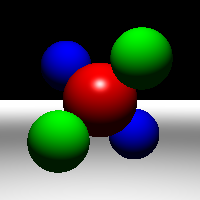
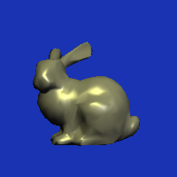
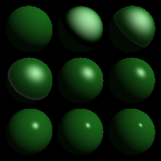

# Assignment 4

## How to run

```bash
# tested on Linux
cmake .
make
./Assignment_4 -input ./data/scene06_shine.txt -size 200 200 -output ./image/scene_6.bmp
```

Enter the path of the `.txt` and `.bmp` file relative to binary executable to run without segfaults.

## Screenshots








## Explanations

### Ray Intersections

#### Sphere

Followed formulas from [this StackOverflow post](https://stackoverflow.com/questions/1986378/how-to-set-up-quadratic-equation-for-a-ray-sphere-intersection).

#### Plane

Equation of a plane is $n \cdot (o + t \cdot d) + \text{offset} = 0$, thus $t = -\frac{offset + n \cdot o}{n \cdot d}$.

#### Triangle

In order to calculate the interpolated normal, we calculate the barycentric coordinates first. We calculate the areas accordingly to get area ABC, $\beta$ and $\gamma$. We then calculate the determinant of 3x3 matrices, which is filled with each vector such as $C-A$ and $B-A$ to get its respective areas. The 1/2 will cancel out when divided with area of ABC. $\alpha$ is calculated using its inside condition $1 - \beta - \gamma$ as shown below in the picture. We then solve for $t$ using Cramer's rule.

#### Transform

We transform the ray origin and direction using the transformation matrix $m$ by multiplying with the $m^{-1}$. We then generate a new Ray instance using the new origin and direction. If the new ray intersects with the object, we compute the new normal vector by multiplying the computed normal vector of the Hit with the transpose of the inverse m. Lastly, we update the Hit with the new normal vector.

### Lighting Computations

To add diffuse intensity $a$, we use the Phong equation $n \cdot l$ to get `diffuse_intensity`. If there is illumination (`intensity > 0`), then we add the diffuse lighting to the shaded color by multiplying it with the material diffuse color and light source color.

To add specular intesnity, we use the Phong equation $r = 2n(n \cdot l) - l$ to get reflect vector r & $r \cdot v$ to get `specular_intensity`. We need to reverse the ray direction $v$ as it is in the opposite direction of the reflection direction. If there is illumination, we add the specular lighting to the shaded color by raising the specular_intensity to the power of the shininess then multiply it with the material specular color and light source color using the Phong equation.
